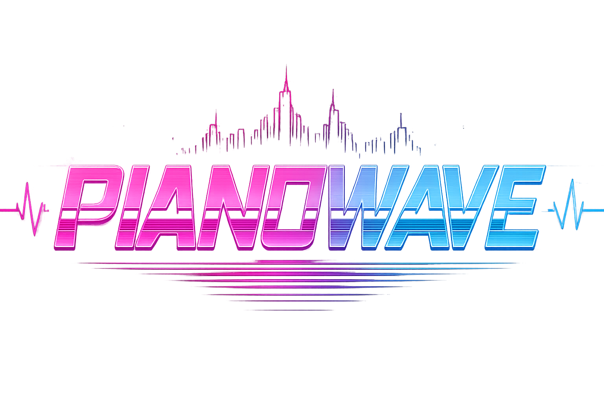

### A synthwave piano-tiles rhythm game built in Unity

[**▶ Play the live demo**](https://www.axelarredondo.com/pianowave)

---

## About

PianoWave is a rhythm game wrapped in a retro CRT-television aesthetic: every menu lives inside an animated 80s TV set, complete with a glowing antenna, a spinning volume dial, and a synthwave city skyline behind the playfield. Notes fall down four lanes in time with the beat, and the goal is simple — tap, hold, and chain combos without missing a cue.

It ships with two ways to play:
- **Level Mode** — hand-authored charts stored as JSON, synced to a song's BPM with support for mid-song speed changes and background theme swaps.
- **Endless Mode** — a procedural difficulty director that ramps note density, introduces double-lane and hold notes, and gently oscillates scroll speed over time, so no two runs feel exactly alike.

## Screenshots

<table>
<tr>
<td> Main Menu</td>
<td> Gameplay</td>
</tr>
<tr>
<td> Settings</td>
<td> Game Over</td>
</tr>
</table>

## Highlights

- **Custom chart system** — songs are defined as portable JSON charts (BPM, note timing, speed events, background events) with an editor-side validator that catches malformed or unplayable charts before they ship.
- **Procedural difficulty director** — `RandomDifficultyManager` drives Endless Mode through four tuned phases, weighting lane selection to avoid repetition, capping consecutive same-lane picks, and spacing out hold notes — all without hand-charting a single beat.
- **Solved real-device input reliability** — raw touch input was inconsistent on some Android hardware (Samsung S23 Ultra), so gameplay input was rebuilt on Unity's `EventSystem` using invisible per-lane UI panels, fixing dropped and ghost touches without changing the desktop input path.
- **Cross-platform** — built and shipped for both Windows (standalone) and Android (APK/AAB), with a safe-area fitter and adaptive camera scaler so the UI and playfield hold up across different aspect ratios and notches.
- **Full audio pipeline** — dedicated music and SFX channels with a persisted settings panel (master/music/SFX volume, fullscreen toggle) driven by an in-fiction volume dial on the TV.
- **Cohesive art direction** — every UI screen (menu, settings, game over) is staged as content playing on the same in-world CRT, reinforced with matching sound design (static, power-on chime, channel-switch clicks).

## Tech Stack

- **Engine:** Unity 6000.3.1f1
- **Language:** C#
- **UI:** Unity UI + TextMesh Pro
- **Platforms:** Windows, Android

## How to Play

- Tap a lane as a note crosses the hit line.
- Hold notes require holding the lane until the note clears.
- Chain hits to build your combo multiplier and score.
- Choose **Levels** for curated charts or **Endless** for procedurally generated runs of increasing difficulty.

---

Built by Axel Arredondo — <a href="https://www.axelarredondo.com">axelarredondo.com</a>

